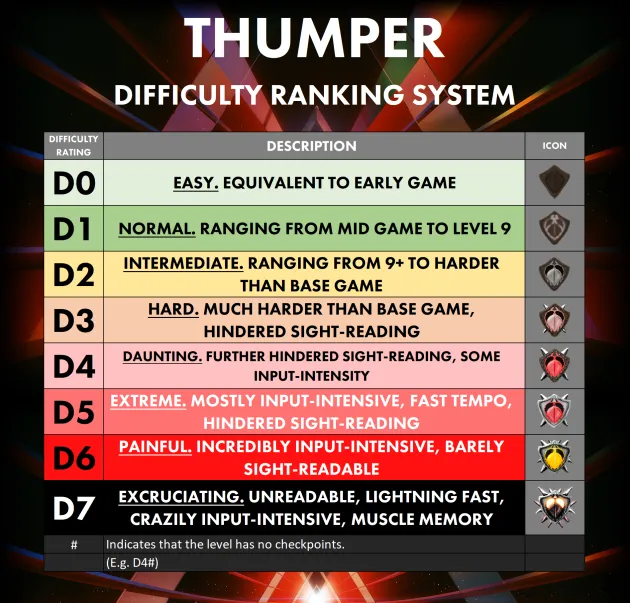

# Additional Resources and Links
* [Official Website](https://thumpergame.com/)
* [Official Thumper Manual](https://thumpergame.com/manual)
* [Thumper Discord Invite Link](https://discord.gg/TVwftcnwtk)
* [THUMPER Manual 2.0](https://docs.google.com/document/d/1zwrpMhfugF7f_sxgpWUM9_cnOXtubOyFIqd7TCRryxM/edit)
* [Subreddit](https://www.reddit.com/r/Thumper_Game)
* [RainbowUnicorn's sample level](https://www.youtube.com/watch?v=I7sURwqwnw0&feature=youtu.be)
* [Thumper Frame Dissection](https://twitter.com/LunaRyuko/status/1103399371968835586)
* [Cross Platform Leaderboard](https://docs.google.com/spreadsheets/d/114LIxOlWBdMCIqDCzwBosppos-BFw8Kurs1BDcR1nLI/edit?usp=sharing)
* [Steam Leaderboards](https://steamcommunity.com/stats/356400/leaderboards)
* [Thumper - How To Climb The Leaderboards](https://youtu.be/ulWMX_nNqio)
* [thump_rails.objlib OFFSETS](https://docs.google.com/spreadsheets/d/1AWWH4omLDRxKZ-yIbTrUrwGt_yYQL1rJhQXa-nHrRpQ/edit?usp=sharing)
* [NinjaRipper](https://gamebanana.com/tools/5638)
* [Noesis](https://richwhitehouse.com/index.php?content=inc_projects.php&filemirror=noesisv4464.zip)
* [Noesis compatibility script](archive/fmt_ninjaripper_rip.py)
* [Thumper Modding Information](https://drive.google.com/drive/folders/1l-DHL2WA0-sfNBaDmoO83oBUQc1aDpP1?usp=sharing)
* [Image Assets](https://drive.google.com/drive/folders/1YxVOgLLdoj3MlwGo8i1RCIZoJIFTANr0?usp=sharing)
* [How to use Custom Audio](https://docs.google.com/document/d/14kSw3Hm-WKfADqOfuquf16lEUNKxtt9dpeWLWsX8y9Q/edit?usp=sharing)
* [Thumper Custom Level Editor Guide](https://youtu.be/bxDgG2yeUk8)
* [nwolc's Every Released TCL](https://drive.google.com/drive/folders/1u55DW4-Igi0dClWemJintllfmczwlRdh)
* [Old ThumpNet Spreadsheet](https://docs.google.com/spreadsheets/d/19SbuARLhHfxTcZXDEGzxeQIdpJR0acTPTNtwrnwUtUI/edit?usp=sharing)
* [ThumpNet Legacy Webcode](https://github.com/anthofoxo/thumpnet)
* [ThumpNetNext / BeetleBot Usage](https://anthofoxo.xyz/thumpnetnext)
* [Thumper Hash Parameters](https://docs.google.com/spreadsheets/d/17PuWTSqCy82WHbfFyNTriYrxEmKad2DVwTRjmLKuQ14/edit?gid=0#gid=0)
* [Thumper Crash Scoring](https://docs.google.com/spreadsheets/d/1lc3pZUjpcvhmA_OW8Ad3pZgHwSfHz9MRZazj_9CkBes/edit?gid=0#gid=0)
* [Thumper Informational Video Archive](https://drive.google.com/drive/folders/1EmFG_0_4uQzkzOGddZlSU03Jlvfo6fxl?usp=sharing)
* [Leaf Format](https://docs.google.com/document/d/13Na2sUzkChSTUCY5kHrDYR79Hml-OptMXTQgCsQu0ak/edit?tab=t.0)
* [Thumper Tentacles, Tunnels, FX & Skybox Colors](https://docs.google.com/document/d/1dGkU9uqlr3Hp2oJiVFMHHpIKt8S_c0Vi27n47ZRD0_0/edit?tab=t.0)
* [Thumper editor values and things](https://docs.google.com/document/d/1iPq4pAJPeORzJSjc47Vb-HA65wEZixVflS98EZ7-oEo/edit?tab=t.0#heading=h.z4z1zza8az8b)
* [Thumper Custom Level Highscores](https://docs.google.com/spreadsheets/d/1ThS4asvBlgHrPzAieFx-E9-mwDc25JqxckIE24YP4Y0/edit?gid=0#gid=0)

## Samples and SFX
* [Thumper SFX (organized)](https://drive.google.com/drive/folders/1Cz6nHvpTi97N_LVG1g8rfkdfEk0p0rDA?usp=sharing)
* [Thumper Samples](https://drive.google.com/drive/folders/1zQw5fUEbPhotijT8dAoRWupyK86thAIg?usp=sharing)
* [Thumper SFX (RainbowUnicorn)](https://www.dropbox.com/sh/2gcoyzqi922i66j/AAAYkfCMm0Q7fFJhCIRfvVhza?dl=0)
* [Loop Tracks](https://drive.google.com/drive/folders/1ne97hmPnoi_aqskdH6kp2BjGQZfaKz_P)

### Sample Sources
#### Boomlibrary cinematic motion designed
* ch-ds hit distorted 03
* ch-ds hit distorted 04
* CH-DS HIT Massive 01
* CH-DS HIT Massive 04
* ch-ds hit scifi 01
#### Eastwest Stormdrum 3
* Various

## Level BPMs and Time Signatures
* Level 1 - 320 BPM (1/4)
* Level 2 - 340 BPM (2/4)
* Level 3 - 360 BPM (3/4)
* Level 4 - 380 BPM (4/4)
* Level 5 - 400 BPM (5/8)
* Level 6 - 420 BPM (6/8)
* Level 7 - 440 BPM (7/8)
* Level 8 - 460 BPM (8/8)
* Level 9 - 480 BPM (9/8)
* Level 10 - 270-550~[^factcheck] BPM

## Difficulty Ranking

# Contributors
* Modding Tools by CocoaMix
* <https://thumper.tiddlyhost.com/> by RainbowUnicorn
* Thumper Wiki by AnthoFoxo

## Footnotes
[^factcheck]: Needs factchecked